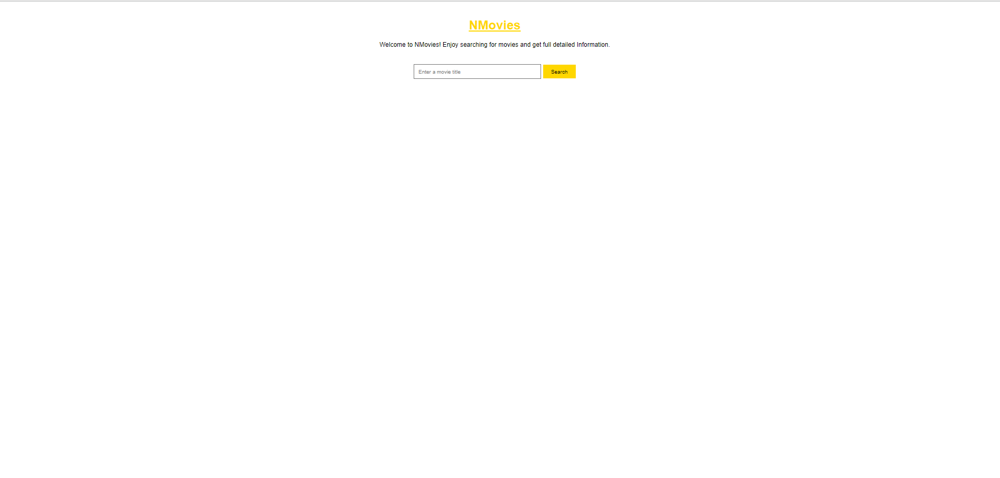
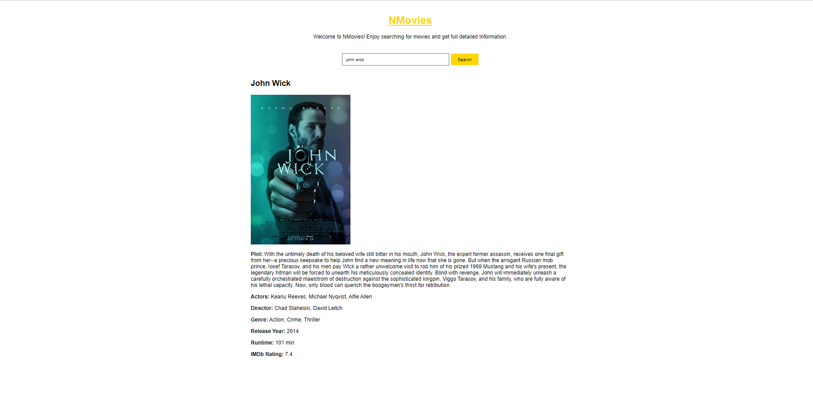
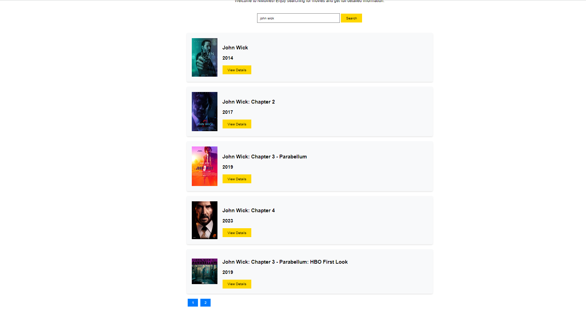

# Nmovies-app
## Local Setup: 
To run the web app locally, follow these steps:

- Clone the project locally.

- Obtain the API key from the OMDb API by signing up on their website.

- Replace 'YOUR_OMDB_API_KEY' in script.js with your actual OMDb API key.

## Functionality:

### 1. Movie Search
Open index.html in a web browser, and you should see the movie search web app.e.g

Enter a movie title in the search input field and click the "Search" button to fetch and display the movie results.e.g 

The web app allows users to search for movies by entering a title in the search input field and clicking the "Search" button. 

It fetches movie data from the OMDb API and displays the results, including the movie poster, title, year, type, and a "View Details" button. Clicking the "View Details" button shows additional information about the movie, such as the title, year, rated, released date, runtime, genre, director, actors, and plot. The web app also provides visible pagination to navigate through the search results.

### 2.Responsiveness and Design: 
The web app is designed to be responsive and visually appealing. It uses CSS styles to ensure that the content adapts well to different screen sizes. The movie results are displayed in a clean and organized format, with the movie poster, title, and details presented in a visually appealing manner. The pagination links are also styled to provide a good user experience.
e.g 
